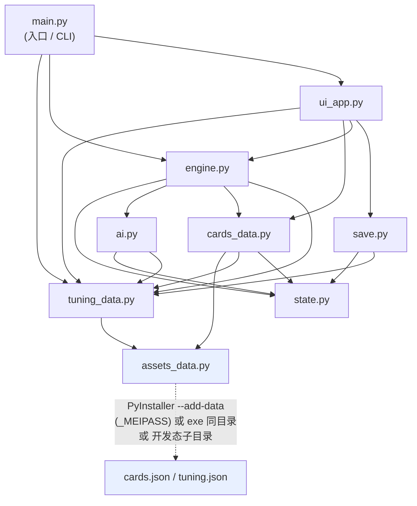

# 《职场营销博弈》技术架构文档

> 项目：职场营销博弈 / Office Marketing Gambit
> 文档类型：技术架构与决策索引（architecture）
> 适用代码版本：当前仓库 HEAD（Python 3.13，仅标准库，tkinter/ttk GUI，PyInstaller 单文件 .exe）
> 配套决策记录：ADR-001（PyInstaller 单文件）、ADR-002（数据外部优先 + --add-data 内嵌）、ADR-003（本地启发式 AI）
> 维护者：engineering-lead（程基岩）

---

## 1. 系统总览与技术约束

- **玩法**：单人 PVE 隐藏派系 / 信任博弈，大框架借鉴《血染钟楼》。玩家与 8 名 AI 同处多家合资公司（派系），靠情况牌周旋博弈。
- **主循环**：12 天，每天推进 6 个阶段（晨会→白天情况牌→午间密谈→夜间行动→日结→联席会议）；第 3 / 6 / 9 / 12 天为联席会议（白盒投票优化）。终局判定玩家「胜 / 负 / 离职观察者（出局旁观）」，并按表现给 S/A/A-/B/B-/C/D 评级。
- **绝对约束**：
  1. 仅标准库；GUI 用 `tkinter` / `ttk`；**运行时零第三方依赖**。
  2. AI 完全**本地、离线、确定性**（规则 / 启发式，公式见 gdd 系统⑤），非 LLM。
  3. 经济合规：现金仅称 **「可动用预算 / 招待额度」**，严禁「行贿」措辞。
  4. 交付为**单文件 Windows .exe，无控制台，离线可玩**，本地内嵌 AI 与数据。

---

## 2. 模块架构图

### 2.1 依赖关系（mermaid）



### 2.2 数据流（ASCII）

```
        design/cards/cards.json ─┐
        config/tuning.json ──────┤  (外部优先：exe同目录 → _MEIPASS → 开发态子目录 → cwd)
                                 ▼
         assets_data.resolve_asset() → load_json_asset()
                  │
    cards_data.load_cards()     tuning_data.TUNING (带 _DEFAULTS 兜底)
                  │                     │
                  └──► 引擎消费 ◄───────┘
                                 │
   main.py --gui                 main.py --headless N
        │                              │
        ▼                              ▼
   ui_app.run_gui()            engine.run_headless()
        │   GUIController(engine.Controller)    │  RandomController(engine.Controller)
        ▼                              ▼
   state.GameState ◄──────────── engine.run_game(state, controller, seed)
        │
        ├─ setup_world → 12 天 × 6 阶段主循环
        │    morning → day_cards(resolve_card) → noon → night → settle → assembly(可选)
        │         │
        │         └─ draw_day_cards → resolve_card(玩家=Controller.pick_card, AI=ai.ai_choose)
        │            → update_belief_trust → chaos / 客户争夺 / 资源结算
        │                         │
        │                         ▼
        │            evaluate_goal / evaluate_sub_goal → final_judge → S~D 评级 + win/lose/observer
        │
        ├─ save.save_game(state) → ~/Documents/职场营销博弈/saves/save_D{n}.json
        └─ save.load_game(path)  → GameState
```

---

## 3. 各模块职责与公开函数清单

### 3.1 `main.py` — 入口与 CLI
- `sys.path` 注入 `src/`；导入 `tuning_data` / `engine` / `ui_app`。
- `argparse` 解析：`--headless N`（质量门冒烟测试，随机策略，崩溃数→返回 0/1）、`--gui`（默认）、`--difficulty {easy,medium,hard}`、`--actors`（默认 `tuning_data.TUNING["NUM_ACTORS"]`=9，允许 7）、`--tier {employee,mid,senior,random}`、`--seed`。
- **公开**：`main(argv=None)`；`_print_headless_summary(summary)`（打印崩溃数 / 结局分布 / 评级分布 / 前 3 示例）。

### 3.2 `assets_data.py` — 资源解析（数据加载核心）
- **公开**：
  - `resolve_asset(name, dev_subdir=None) -> str`：按候选顺序返回最佳可用路径，任一命中即返回：
    1. 可执行文件 / 脚本所在目录同名文件（**热更首选**：exe 同目录放同名文件即覆盖）；
    2. PyInstaller 临时解包目录 `sys._MEIPASS`（**构建期内嵌副本**，由 `--add-data` 打包）；
    3. 开发态子目录 `exe_dir/dev_subdir/name` 与 `cwd/dev_subdir/name`；
    4. `cwd/name`。
    找不到时返回候选 1 的推测路径，由调用方 `open` 时报错以便定位。
  - `load_json_asset(name, dev_subdir=None) -> dict`：解析后 `json.load`。
- **设计要点**：**无 base64、无内嵌副本兜底**——健壮性来自「多候选路径 + 调用方容错」而非把数据塞进 .py。tuning 在 `tuning_data` 另有 `_DEFAULTS` 兜底（见 §3.3）。这是与早期方案的差异（见 §7.4）。
- **经济合规**：仅做路径解析与读取；合规措辞由消费端（engine / ui）保证。

### 3.3 `tuning_data.py` — 平衡配置加载
- 常量：`FACTIONS = ["FV_A","FV_B","FV_C","FV_D"]`、`TIERS = ["employee","mid","senior"]`。
- `_DEFAULTS`：极简兜底默认值（DAY_MAX / CARDS_PER_DAY* / ASSEMBLY_DAYS / NUM_ACTORS / DIFFICULTY / AI_WEIGHTS / FACTION_BASELINE 等）。
- `TUNING = assets_data.load_json_asset("tuning.json","config")`，失败时回退 `_DEFAULTS`；随后 `for k,v in _DEFAULTS.items(): TUNING.setdefault(k,v)` **保证关键键存在**（不覆盖已加载值）。
- **公开**：`diff(name)`（安全链 `d.get(name) or d.get("medium") or d.get("easy") or next(iter(d.values()))`，避免缺键 KeyError）；`faction_alias(fkey)` / `faction_color(fkey)` / `faction_goal(fkey)`。
- **说明**：`config/tuning.json` 为**富 schema**（RESOURCES / INIT_RESOURCES / TIER_MODS / TIER_WEIGHT_FOR_POWER / PRICES / BRIBE_CAP / DIFFICULTY / AI_WEIGHTS / FACTION_BASELINE / TAG_GOAL_BONUS / GOAL_THRESHOLDS / CLIENTS / CHAOS / CARD_DRAW / DAY_CURVE / DERIVED / SPEECH_TEMPLATES / FACTIONS）。**引擎恰好消费这一富 schema**，因此开发态从项目根直跑 `python main.py` 会命中 `config/tuning.json` 并正常启动（无 §旧文档所述「富 schema 崩溃」问题——那是已被推翻的旧设计）。

### 3.4 `cards_data.py` — 情况牌加载与抽牌
- **公开**：
  - `load_cards() -> (list, meta)`：经 `assets_data.load_json_asset("cards.json","design/cards")` 读取，**归一化**每张牌的 choices → `{id,label,arch, player:{influence,stress,cash}, faction_trust:{FV_A..FV_D:int}}`；带模块级缓存。
  - `card_count() -> int`：当前牌库张数（验收要求 256）。
  - `CATEGORY_ICONS` / `CATEGORY_ORDER`：12 大类图标与顺序。
  - `draw_day_cards(state, day, n) -> list`：抽 n 张，**保证来自 n 个不同 category**；类内用「tier 权重 × 情境匹配权重」轮盘赌（`_roulette`）；情境匹配 `_situation_match`（派系信任领先 / 高压力 / 高混沌 / 客户濒危）来自 `TUNING["CARD_DRAW"]` 与 `DAY_CURVE`。
  - `choice_summary(ch) -> str`：把 effects 渲染为「声望+/压力+/预算+」文本（合规口径）。
- `cards.py`：薄再导出垫片（`from cards_data import *`），保留旧 `import cards` 写法兼容，**不参与 shipping 主路径**（主路径直接用 `cards_data`）。

### 3.5 `state.py` — 数据模型
- `clamp(v, lo, hi)`。
- `Actor`（dataclass）：`idx / name / is_player / tier / faction / personality / influence / stress / cash / alive / out_day / out_cause / trust(Dict[int,float]) / belief(Dict[int,List[float]]) / betrayals / actions / influence_zero_days / motivation / revealed / ability_cd`；`faction_alias` 属性；`vote_weight()`（查 `TIER_MODS[tier]["vote_weight"]`）。
- `GameState`：
  - 字段：`rng / difficulty / num_actors / actors / day / phase / faction_trust / chaos / clients / log / used_cards / assembly / result / observer / ended_early / clients_taken / clients_lost / _diff`。
  - 方法：`clamp_actor(a)`（按 `RESOURCES` 夹 influence 0-100 / stress 0-100 / cash -30~300）、`alive_actors()`、`player()`（返回 `actors[0]`）、`faction_members(f, alive_only)`、`power_score(f)`（按 `TIER_WEIGHT_FOR_POWER` 加权 influence + senior 座席加成）、`log_msg`、`ensure_belief` / `ensure_trust`、`rival_faction(a)`。
  - 常量：`PHASES = [morning, day_cards, noon_talk, night, settle, assembly]`、`PHASE_LABELS`。

### 3.6 `ai.py` — 启发式 AI（gdd 系统⑤ 5.3.2 / 5.3.3 / 5.3.6）
- **效用函数** `compute_utility(a, ch, state)`：`u = _w_inf·Δinf + _w_str·Δstr + _w_cash·Δcash + ALPHA·_goal_align + BETA·_reciprocity + GAMMA·_concealment − DELTA·_risk + ε`，其中 `ε = uniform(−τ, τ)`、`τ` 受 `tau_temperature` 与 `risk_appetite` 调节；并对「现金穿底 / 压力崩溃」做硬性扣分。`_goal_align` 用 `TAG_GOAL_BONUS` 与派系信任；`_reciprocity` 用 belief/trust 期望；`_risk` 含被识破 suspicion。
- `ai_choose(a, card, state) -> (idx, hint)`：逐 choice 打分取最大；并列时按性格 tiebreak；`hint` 为动机提示（供 UI 显示「态度模糊，难以捉摸」等）。
- `update_belief_trust(state, observer, actor, ch)`：贝叶斯式 belief 更新（按 choice 的 `faction_trust` 调 belief 概率质量）+ trust 漂移（shield 加成、rival 减分）。
- `ai_vote_score(a, target, state)` / `ai_vote(a, candidates, state)`：白盒投票——投给「最可能是 rival 派系 + 最不信任 + 声望/权重威胁最大」者；受玩家买票（`assembly["player_bribed"]`）、指认、player_focus_bias 影响。
- `ai_night(a, state)`：高层「调阅背景」识破 rival；其余「施压」加对方压力、降信任。
- **确定性**：rng 由 `state.rng` 注入，种子可复现；无网络、无 LLM。

### 3.7 `engine.py` — 游戏主引擎
- **公开**：
  - `setup_world(difficulty, num_actors, player_tier, seed) -> GameState`：按 `tuning` 分配 tier 分布（`_tier_distribution`）、派系名额（`_faction_counts`，默认每派系 2 人 + 多余轮转）、姓名池、性格（`FACTION_BASELINE` + 高斯噪声）、初始资源（`INIT_RESOURCES` + 难度 `player_start_offset`）、信任/信念初始化、8 个客户（每派系 2，初始 `client_start_stability`）。
  - `apply_choice(state, actor, ch, is_player)`：按 `TIER_MODS`、`DERIVED`（高声望减益 / 低声望减压 / 高压减益）、难度缩放（玩家惩罚 / AI 增益）、`single_card_net_clamp` 夹单卡净收益后作用资源。
  - `resolve_card(state, card, controller)`：玩家（若存活，`Controller.pick_card`；压力过载偶发「失态」随机选）与每个存活 AI（`ai_choose`）分别选 choice 并 `apply_choice`；随后两两 `update_belief_trust`；按 choice 的 `arch` 累加 chaos、做客户争夺（`apply_client_effects`：invest/cashin 升己方稳定，betray/expose/risk 降敌方稳定，稳定≤20 触发易主并记 `clients_taken/lost`）。
  - `phase_morning / phase_day_cards / phase_noon / phase_night / phase_settle / phase_assembly`：6 阶段推进。
    - `phase_settle`：每日压力自然回落（`RESOURCE_NATURAL`）、中层额外加压、现金为负加压力、声望溢出转现金（`influence_overflow_to_cash`）、压力临界降声望、声望清零计数达 `INFLUENCE_ZERO_GRACE` 出局、玩家资金穿底且为联席会议日偶发出局（审计约谈）、chaos 每日衰减。
    - `phase_assembly`：玩家 `Controller.assembly_speech`（accuse/defend/deflect）、`assembly_bribe`（≤`bribe_cap`，按 `PRICES["buy_vote"]` 花费）、AI 投票 `ai_vote`、按 `vote_weight` 计票、最高票出局（平票取声望低者）、累加 chaos。
  - `_eliminate(state, actor, cause)`：置 `alive=False`、记 `out_day/out_cause`；玩家出局置 `state.observer=True`。
  - `evaluate_goal(state, fkey)`：**四派系差异化目标**——FV_A 夺客数（full/bare/disaster/fail）、FV_B 守客（丢失数 + 平均稳定）、FV_C 权势分 `power_score`（full/bare/fail）、FV_D 低压力 + 低混沌（用玩家压力作代理）。阈值来自 `GOAL_THRESHOLDS[fkey][difficulty]`。
  - `evaluate_sub_goal(state, fkey)`：派系子目标近似（如 FV_A 有对手出局、FV_B 声望≥55、FV_C 背叛≥3、FV_D 现金≥60 且非审计出局）。
  - `final_judge(state) -> dict`：综合 `alive` / `faction_tier` / `sub_ok` 给 **S/A/A-/B/B-/C/D 评级**与 `win/lose/observer` 结局；产出 `reveal`（全员身份揭示）、`chaos / power_score / clients_taken / clients_lost` 等统计。
  - `Controller`：玩家决策接口（GUI 覆写 / headless 用 `RandomController`）；方法 `show_info / pick_card / noon_talk / night_action / assembly_speech / assembly_bribe / assembly_vote / game_over`。
  - `RandomController(Controller)`：质量门随机策略。
  - `run_game(difficulty, num_actors, player_tier, controller, seed) -> dict`：12 天主循环，返回 `final_judge` 结果。
  - `run_headless(num_games, difficulty, num_actors, player_tier, seed) -> dict`：质量门，统计 `crashes / outcomes / ratings / examples`。

### 3.8 `save.py` — 存档
- **公开**：
  - `save_game(state, path=None) -> str`：序列化 day/phase/chaos/faction_trust/clients/clients_taken/lost/used_cards(→list)/observer/log[-200]/actors（含 trust/belief 等）为 JSON。冻结态写到 `~/Documents/职场营销博弈/saves/save_D{n}.json`，开发态/失败回退到 exe 同目录 `saves/`。
  - `load_game(path) -> GameState`：反序列化并重建 `actors`、定位 `player`、`_diff`。

### 3.9 `ui_app.py` — Tkinter GUI
- `GameApp`：1280×720，暗底 + 四派系色 + 烛光琥珀（遵循 art-bible）；顶栏天数/阶段 + 三资源条（声望/压力/可动用预算）+ 派系目标；中栏卡面 + **≥4 个选项按钮**；右栏局势日志；结局「身份揭示」Toplevel。
- **线程模型**：worker 线程跑引擎主循环，主线程用 `threading.Event` + `wait_variable` 模式收集玩家输入（单显示线程安全）。
- `GUIController(engine.Controller)`：把 Tk 交互桥接进引擎回调（选牌 / 午间密谈 / 夜间行动 / 联席会议指认·自辩·转移·买票 / 投票）。
- `run_gui(difficulty, num_actors, player_tier, seed)`：建 `GameApp` + worker 线程 + `mainloop`。

---

## 4. 主循环阶段推进（run_game）

```
for day in 1..DAY_MAX(12):
    state.day = day
    phase_morning   → 日志 + 晨会提示
    phase_day_cards → n = (day>2 ? CARDS_PER_DAY_BASE : CARDS_PER_DAY_RAMP[day])；draw_day_cards → 逐张 resolve_card
    phase_noon      → 玩家可选密谈对象（Controller.noon_talk）
    phase_night     → 玩家夜间行动（Controller.night_action）+ AI ai_night
    phase_settle    → 资源自然变化 / 出局判定 / chaos 衰减
    if day in ASSEMBLY_DAYS[3,6,9,12]:
        phase_assembly → 指认/自辩/转移 + 买票 + 计票出局
    if len(alive_actors()) <= 1: ended_early = True; break
final_judge → rating(S~D) + outcome(win/lose/observer)
```

---

## 5. 数据加载分层策略（外部优先 → _MEIPASS 内嵌 → 开发态）

### 5.1 候选路径顺序（`assets_data.resolve_asset`）
1. **exe / 脚本同目录同名文件**（热更首选）：`{exe_dir}/cards.json`、`{exe_dir}/tuning.json`。
2. **PyInstaller 临时解包目录**：`sys._MEIPASS/cards.json`、`sys._MEIPASS/tuning.json`（由构建期 `--add-data` 内嵌）。
3. **开发态子目录**：`{exe_dir}/design/cards/cards.json`、`{exe_dir}/config/tuning.json`，以及 `cwd` 对应子目录。
4. **cwd 同名文件**。

任一路径 `os.path.isfile` 命中即采用；全不命中则返回候选 1 的推测路径，由 `open` 抛错（便于定位）。`tuning` 另有 `tuning_data._DEFAULTS` 兜底，避免极端情况下直接崩。

### 5.2 为什么这样设计
- **离线 / 单文件优先**：构建期把 JSON 打进 exe（`--add-data` → `_MEIPASS`），运行时从 `_MEIPASS` 读取，无需随附外部文件。
- **热更零重打包**：exe 同目录放同名 `cards.json` / `tuning.json` 即覆盖生效，策划改数不改码。
- **开发态顺手**：从项目根跑 `python main.py` 自动命中 `design/cards`、`config` 源数据。
- **容错**：路径均为「存在即取」，无 base64 解码失败风险；调参缺键时 `_DEFAULTS` 兜底。

### 5.3 ⚠ 风险：外部 tuning.json 与内嵌 schema 一致性（已收敛，低优先级）
- 当前 `config/tuning.json` 为**富 schema**，而 shipping 引擎（state / engine / ai / cards_data）**恰好消费同一富 schema**，`tuning_data` 再叠 `_DEFAULTS` 兜底。因此「外部优先」不会造成早期担心的「富 schema 崩溃」——那套担忧基于已被推翻的旧（简单引擎）设计。
- **唯一残留风险**：若有人把 `tuning.json` 改成与引擎消费键不符的结构，会触发 KeyError；`_DEFAULTS` 仅兜最低限度键。建议改数后跑一次 `python main.py --headless 5` 验证。

---

## 6. 构建与运行说明

### 6.1 开发态（解释器运行，需 Python 3.13）
```bash
python main.py --gui                 # 启动 tkinter GUI（默认）
python main.py --headless 50         # 质量门冒烟测试（随机策略跑 50 局，打印结局分布与崩溃数）
python main.py --headless 200 --difficulty hard --seed 42
python main.py --gui --difficulty hard --actors 9 --tier senior
```
- 数据取自 `design/cards/cards.json` 与 `config/tuning.json`（开发态子目录命中）；缺则回退 `_MEIPASS`/exe 同目录/内嵌兜底。

### 6.2 冻结态（单文件 .exe）
- 构建命令（**构建期**依赖 PyInstaller，非运行时依赖）：
```bash
python build_exe.py          # 推荐：封装好的跨平台打包（等价于 pyinstaller build.spec）
# 或
pyinstaller build.spec
# 产物：dist/职场营销博弈.exe
```
- 运行：双击 `dist/职场营销博弈.exe`（Windows；无控制台、离线、本地 AI）。
- 数据：构建期内嵌于 `_MEIPASS`；若 exe 同目录放同名 `cards.json` / `tuning.json` 可热更。
- 存档：`~/Documents/职场营销博弈/saves/`（冻结态）。

### 6.3 运行期错误处理
- 数据加载链「存在即取」，无解码失败风险；tuning 缺键有 `_DEFAULTS` 兜底。
- GUI 启动失败（无显示器 / 缺 tkinter）时回退提示用 `--headless`。

---

## 7. 已知技术债与后续演进

### 7.1 平衡观察（需 design / 主理人复核）
- **混沌度（chaos）极易触顶 100**：每次冲突牌 +4、泄密 +6、出局 +8、每日仅 −2。随机策略下几乎每局都触顶。当前数值使 chaos 信息量偏低——属**调参杠杆**，建议在 `tuning.json` 的 `CHAOS` 与 `CARD_DRAW` 档位上重新标定（如提高 `daily_decay`、降低单次增量）。
- **随机策略下「离职观察者」结局占多数**（medium 36/50、hard 27/50、easy 27/50、7 人 41/50）：随机 Controller 不懂自保，易被投出局；这是**质量门（不崩 + 收敛）**而非平衡 oracle。真实玩家有策略时分布会不同。`run_headless` 的 `win/lose/observer` 仅用于回归守护，不应用于平衡定论。
- **评级分布偏 D**（出局多），S/A 占比低——与「观察者多」同源；可由难度曲线与 AI 凶悍度（`ai_aggressiveness`）调节。

### 7.2 `archive/legacy_game_package` —— 旧版富引擎快照（状态：归档 / 未集成）
- 这是一个**更早的、包化（相对导入）**富引擎实现快照，与当前 shipping 的扁平 `src/` 引擎在**同一设计意图**上（客户争夺、chaos、6 阶段、评级、belief/trust 等），但**模块组织与部分命名不同**，且**未被 `main.py` 导入**。
- 当前 `main.py` 导入的是扁平 `src/*` 模块（本文档描述者）。该归档包仅作设计/演进参考，**切勿让它被 `main.py` 意外导入**（会触发相对导入错误）。
- 若未来要演进到更丰富的引擎，须统一「包化 vs 扁平」组织、统一数据 schema、并补测试——在此之前保持归档隔离。

### 7.3 AI 确定性与可调试
- 全部启发式、确定性（rng 由 `state.rng` 注入、种子可复现），无 LLM、无网络。`run_headless` 直接做「不崩 + 收敛」质量门。
- 行为可被玩家摸透规律（白盒），缺乏真正自然语言叙事——符合 MVP 与 ADR-003 取舍。

### 7.4 数据加载机制演进史（小）
- 早期方案曾考虑「base64 把 JSON 塞进 `cards_data.py`/`tuning_data.py` 作内嵌兜底」，并留了 `tools/gen_embed.py`。**当前实现已弃用该方案**：改为 `assets_data` 文件优先 + PyInstaller `--add-data` 内嵌（更透明、更好热更、无解码风险）。`tools/gen_embed.py` 现为**遗留脚本，不参与构建**，可保留或删除。
- 旧的 `职场营销博弈.spec` 用**绝对路径**且只 `hidden-import` 2 个模块，**已过时**；新构建一律用 `build.spec`（相对路径、9 个 hiddenimports、datas 内嵌）。请勿用旧 spec。

### 7.5 读档一致性（简化）
- 读档重建 `actors` 与 `used_cards`，但 `rng` 不持久化（读档后随机态重置）；正式存档系统可记录 rng 状态 / 完整牌序以完全续局。当前属已知简化，不影响试玩。

### 7.6 经济合规（持续）
- shipping 引擎与 GUI 全程使用「可动用预算 / 招待额度 / 买票 / 指认 / 自保」等合规措辞，无「行贿」。演进到更丰富特性时仍须审计措辞。

---

## 8. 术语表
- **FV_A..FV_D**：四家合资公司派系（锐盟 / 衡明 / 星海 / 长安），内部键 `FV_A~D`。
- **情况牌**：每日抽取的情境卡（256 张 / 12 类 / 每张 4 选项），影响声望 / 预算 / 派系信任。
- **联席会议**：第 3 / 6 / 9 / 12 天的白盒投票优化环节。
- **买票**：用「可动用预算」影响他人得票（`PRICES.buy_vote` 万/票，≤`bribe_cap`）。
- **离职观察者**：玩家出局后以旁观视角看完本局（无黑屏，快进 + 身份揭示）。
- **混沌度（chaos）**：全局冲突指数 0-100，由背叛/泄密/出局推高、每日衰减。
